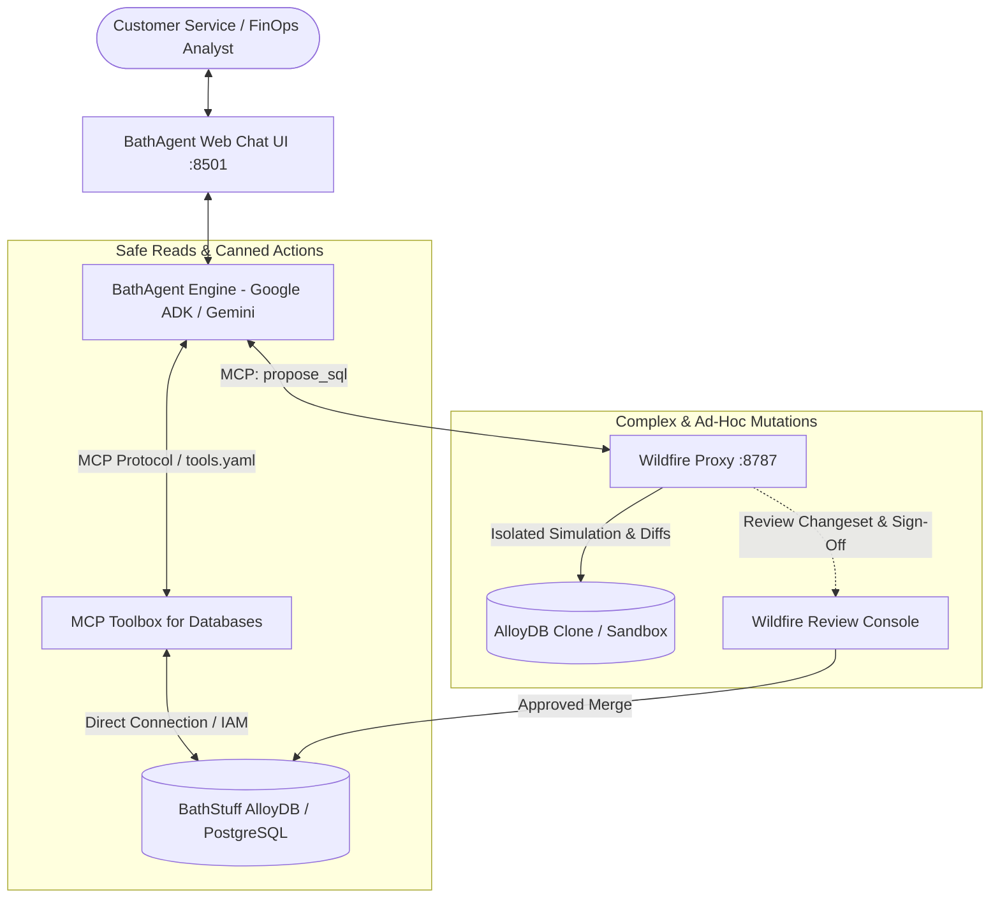

# 🛁 BathAgent

> **AI-Powered Customer Operations Assistant with Safe Database Mutations**  
> Built with **Google ADK**, **MCP Toolbox for Databases**, and the **Wildfire Proxy**.

---

## 📖 Overview

**BathAgent** is an enterprise AI assistant designed for **BathStuff**, the world's fifth-largest online retailer of health and beauty products. It serves customer service representatives and FinOps analysts by enabling conversational workflows over production database assets while rigorously preventing unintended data corruption.

### 🛡️ Core Security & Isolation Principles

1. **Read-Only Exploration & Canned Operations**:
   * Powered by the **MCP Toolbox for Databases**.
   * Exposes strictly parameterized safe tools (`lookup_customer_orders`, `get_order_details`, `create_customer_order`, `cancel_unshipped_order`).
   * Provides a read-only `execute_sql_read_only` tool that strictly rejects all mutating SQL keywords (`INSERT`, `UPDATE`, `DELETE`, `DROP`, `ALTER`).

2. **Complex, Bulk, or High-Risk Mutations**:
   * The agent has **no direct write privileges** on the production database.
   * All mutating workflows (such as retroactive tax/tariff recalculations or bulk corrections) are routed via the **Wildfire Proxy** (`propose_sql(validation="sandbox")`).
   * Wildfire isolates the change in an ephemeral sandbox clone, computes row-level before/after diffs, checks compliance policies (e.g. zero net customer balance impact for goodwill adjustments), and queues the changeset for human review in the Wildfire Console (`:8787`).

---

## 🏛️ System Architecture



---

## 🎯 Demo Scenarios

| Scenario | Trigger / User Prompt | Tools Used | Expected Outcome |
| :--- | :--- | :--- | :--- |
| **1. Customer Order Lookup** | *"Can you find all recent orders for customer Alice Smith (ID: 101)?"* | Toolbox: `lookup_customer_orders` | Returns customer order history, statuses, and delivery dates. |
| **2. Order Cancellation** | *"Please cancel order #1001 for customer Alice Smith."* | Toolbox: `cancel_unshipped_order` | Verifies order is unshipped; cancels order and confirms status. |
| **3. Read-Only Business Query** | *"What are our top 3 best-selling toothpastes by quantity?"* | Toolbox: `execute_sql_read_only` | Runs aggregate `SELECT` query in read-only mode. |
| **4. Toothpaste Tariff Troubles** | *"Identify every product imported from Elbonia subject to the new 20% tariff post-July 1, 2026. Append a 20% tariff charge and an equal offsetting credit so the customer total doesn't change."* | 1. Toolbox: `execute_sql_read_only`<br>2. Wildfire: `propose_sql(validation="sandbox")` | 1. Finds affected orders.<br>2. Formulates paired SQL line items.<br>3. Proposes changeset to Wildfire.<br>4. Returns Changeset ID and direct link to Wildfire Review Console (:8787). |

---

## 🚀 Quickstart Guide

### Option 1: Local Python Setup (Lightweight / SQLite Fallback)

```bash
# 1. Clone the repository
git clone https://github.com/AndrewBrook-Google/bathagent.git
cd bathagent

# 2. Create virtual environment & install dependencies
python3 -m venv .venv
source .venv/bin/activate
pip install -r requirements.txt

# 3. Configure environment
cp .env.example .env
# Edit .env and set GEMINI_API_KEY (optional: set USE_SQLITE=true for instant local DB)

# 4. Initialize and seed database
python3 -m bathagent.database.init_db --sqlite

# 5. Launch the Web UI
streamlit run bathagent/ui/app.py
```

### Option 2: Docker Compose Setup

```bash
docker-compose up -d
```
* **BathAgent Web UI**: Open [http://localhost:8501](http://localhost:8501)
* **PostgreSQL Database**: Running on `localhost:5432`

---

## 🔗 Connecting to the Wildfire Proxy

To run with live Wildfire Proxy validation:
1. Start the Wildfire container (from the `wildfire-m0` repo):
   ```bash
   make build-demo
   docker-compose -f compose.yaml -f compose.vertex.yaml up -d
   ```
2. Navigate to the Wildfire Console at [http://localhost:8787](http://localhost:8787) (`Agents` page) and generate an API token.
3. Add the token to your `.env`:
   ```env
   WILDFIRE_URL=http://localhost:8787
   WILDFIRE_API_TOKEN=<your_token>
   ```

---

## 📂 Repository Structure

```
bathagent/
├── README.md                   # Project overview & demo guide
├── pyproject.toml / requirements.txt
├── docker-compose.yaml         # PostgreSQL & BathAgent container definitions
├── Dockerfile
├── .env.example                # Environment configuration template
│
├── bathagent/                  # Main Python package
│   ├── __init__.py
│   ├── agent.py                # Google ADK agent & orchestration logic
│   ├── cli.py                  # Terminal interactive interface
│   ├── config.py               # Settings loader
│   │
│   ├── database/               # Database DDL & deterministic seeders
│   │   ├── schema.sql          # BathStuff production schema (AlloyDB / Postgres)
│   │   ├── seed.py             # Scenario seed data generator
│   │   └── init_db.py          # Database setup utility
│   │
│   ├── tools/                  # MCP tool integrations
│   │   ├── toolbox_client.py   # MCP Toolbox for Databases client (safe reads/writes)
│   │   └── wildfire_client.py  # Wildfire Proxy MCP client (sandbox mutations)
│   │
│   └── ui/
│       └── app.py              # Streamlit Web UI with demo scenario buttons
│
└── config/
    └── toolbox/
        └── tools.yaml          # MCP Toolbox configuration
```

---

## 📄 License
Internal Google prototype demo for BathStuff and Wildfire.
