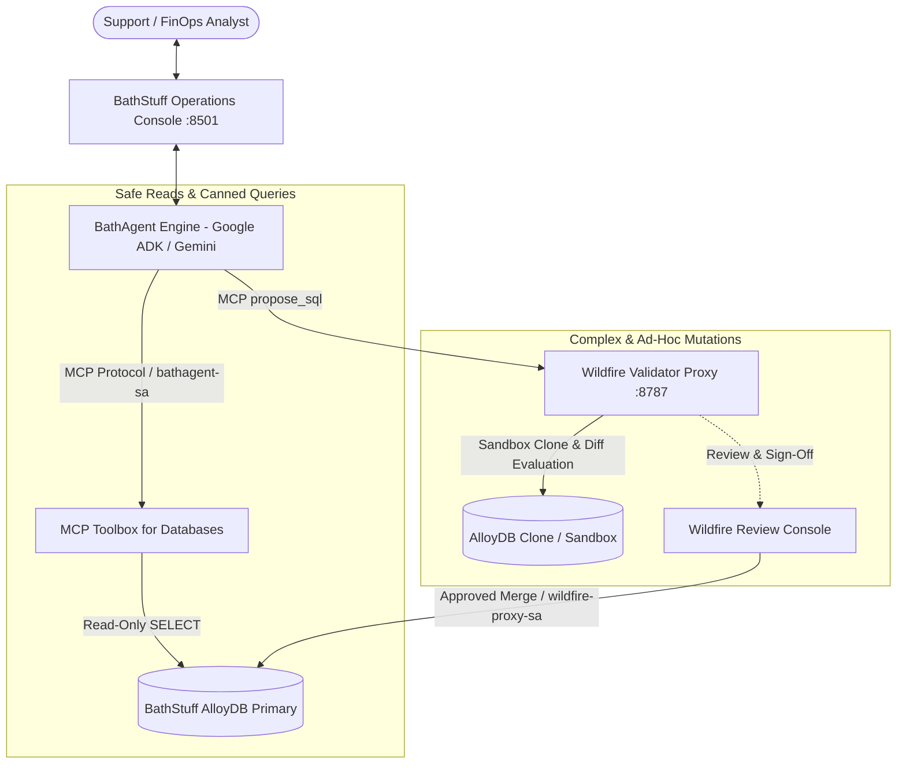

# 🛁 BathAgent

> **Enterprise AI Assistant for BathStuff Customer Operations & Safe Database Mutations**  
> Built with **Google ADK**, **MCP Toolbox for Databases**, and the **Wildfire Proxy**.

---

## 📖 Overview

**BathAgent** is an internal operations assistant for **BathStuff** (a major health & beauty online retailer). It allows Customer Support representatives and FinOps analysts to interact with customer orders, run analytics, and safely propose complex database adjustments against production **AlloyDB for PostgreSQL** instances.

### 🛡️ Security & Isolation Architecture



---

## 🔑 IAM & Service Account Security Model

To enforce the principle of least privilege, two distinct Service Accounts are used:

| Service Account | Role / Database Privileges | Purpose |
| :--- | :--- | :--- |
| **`bathagent-sa`** | • `roles/alloydb.client`<br>• DB Grant: `SELECT` only on production tables. | Used by BathAgent & MCP Toolbox for customer lookups and read-only analytics. Has **zero direct write access**. |
| **`wildfire-proxy-sa`** | • `roles/alloydb.admin`<br>• DB Grant: `ALL PRIVILEGES` on production tables. | Used exclusively by Wildfire Proxy to create ephemeral sandbox clones, compute row-level diffs, and merge approved changes. |

👉 For full step-by-step IAM and PostgreSQL permission setup, see [docs/setup_guide.md](docs/setup_guide.md).

---

## 🚀 Quickstart Guide

### 1. Configure Environment

Copy `.env.example` to `.env` and fill in your AlloyDB, Gemini, and Wildfire credentials:

```bash
cp .env.example .env
```

```env
GEMINI_API_KEY=your_gemini_api_key
GEMINI_MODEL=gemini-2.5-flash

# AlloyDB Connection
DB_HOST=10.x.x.x
DB_PORT=5432
DB_USER=bathagent-sa@PROJECT_ID.iam
DB_PASSWORD=
DB_NAME=bathstuff

# Service Endpoints
TOOLBOX_URL=http://localhost:5000
WILDFIRE_URL=http://localhost:8787
WILDFIRE_API_TOKEN=your_wildfire_token
```

### 2. Install Dependencies & Launch Application

```bash
python3 -m venv .venv
source .venv/bin/activate
pip install -r requirements.txt

# Launch the Operations Console
streamlit run bathagent/ui/app.py
```

Open [http://localhost:8501](http://localhost:8501) in your browser.

---

## 📂 Repository Structure

```
bathagent/
├── README.md                   # Project overview & architecture summary
├── pyproject.toml / requirements.txt
├── .env.example                # Environment configuration template
│
├── bathagent/                  # Core Application Package
│   ├── __init__.py
│   ├── agent.py                # Google ADK agent engine & tool bindings
│   ├── cli.py                  # Interactive CLI interface
│   ├── config.py               # Settings loader
│   │
│   ├── tools/                  # MCP Client integrations
│   │   ├── __init__.py
│   │   ├── toolbox_client.py   # MCP Toolbox client (reads & canned DQL)
│   │   └── wildfire_client.py  # Wildfire MCP client (propose_sql & changesets)
│   │
│   └── ui/                     # Enterprise Web Console
│       └── app.py              # Streamlit customer operations interface
│
├── config/
│   └── toolbox/
│       └── tools.yaml          # MCP Toolbox definitions
│
├── docs/                       # In-Depth Guides & Specifications
│   ├── architecture.md         # Detailed system design & isolation boundaries
│   └── setup_guide.md          # Step-by-step AlloyDB, IAM & Wildfire setup manual
│
└── scripts/                    # Isolated Setup & Reference Scripts
    └── db/
        ├── schema.sql          # AlloyDB DDL schema
        └── seed_data.py        # Reference deterministic seed data generator
```

---

## 📚 Detailed Documentation

* [System Architecture Specification](docs/architecture.md)
* [AlloyDB & Wildfire Setup Guide](docs/setup_guide.md)
