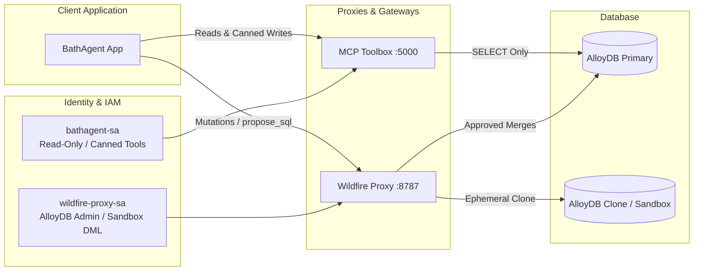

# BathStuff System Setup & Deployment Guide

This guide details the complete end-to-end setup for the **BathStuff Operations AI Assistant**, including configuring **AlloyDB for PostgreSQL**, provisioning dedicated **Service Accounts**, running the **Wildfire Validator Proxy**, setting up **MCP Toolbox for Databases**, and deploying the **BathAgent** application.

---

## 🏛️ Architecture & Security Model



---

## 1. Service Account & IAM Configuration

BathAgent enforces the **Principle of Least Privilege** using two distinct Google Cloud Service Accounts:

1. **`bathagent-sa`**:
   * Assigned to the BathAgent application and MCP Toolbox.
   * Has read-only permissions on AlloyDB for querying customer accounts, order statuses, and read-only analytical SQL.
   * **Zero direct write/DML access** to production tables.
2. **`wildfire-proxy-sa`**:
   * Assigned exclusively to the Wildfire Validator Proxy.
   * Has permissions to create ephemeral AlloyDB database clones, test mutations in isolated sandboxes, and apply approved SQL changesets.

### Step 1.1: Create Service Accounts in GCP

```bash
export PROJECT_ID=$(gcloud config get-value project)

# 1. Create BathAgent Service Account
gcloud iam service-accounts create bathagent-sa \
    --description="Service account for BathAgent read-only lookups and MCP Toolbox" \
    --display-name="BathAgent Service Account"

# 2. Create Wildfire Proxy Service Account
gcloud iam service-accounts create wildfire-proxy-sa \
    --description="Service account for Wildfire Proxy sandbox clone management and DML validation" \
    --display-name="Wildfire Proxy Service Account"
```

### Step 1.2: Grant GCP IAM Roles

```bash
# Grant AlloyDB Client role to bathagent-sa (allows network connection)
gcloud projects add-iam-policy-binding $PROJECT_ID \
    --member="serviceAccount:bathagent-sa@${PROJECT_ID}.iam.gserviceaccount.com" \
    --role="roles/alloydb.client"

# Grant AlloyDB Admin role to wildfire-proxy-sa (allows sandbox cloning & DML)
gcloud projects add-iam-policy-binding $PROJECT_ID \
    --member="serviceAccount:wildfire-proxy-sa@${PROJECT_ID}.iam.gserviceaccount.com" \
    --role="roles/alloydb.admin"
```

---

## 2. AlloyDB Database Configuration

### Step 2.1: Grant Database Permissions (PostgreSQL Roles)

Connect to your AlloyDB primary instance using `psql`:

```bash
# Connect via AlloyDB Auth Proxy or PSC IP
psql -h <ALLOYDB_IP> -U postgres -d bathstuff
```

Run the following SQL statements to configure database-level role isolation:

```sql
-- 1. Create IAM Users inside PostgreSQL
CREATE USER "bathagent-sa@${PROJECT_ID}.iam" WITH LOGIN;
CREATE USER "wildfire-proxy-sa@${PROJECT_ID}.iam" WITH LOGIN;

-- 2. Configure bathagent-sa (Read-Only)
GRANT CONNECT ON DATABASE bathstuff TO "bathagent-sa@${PROJECT_ID}.iam";
GRANT USAGE ON SCHEMA public TO "bathagent-sa@${PROJECT_ID}.iam";
GRANT SELECT ON ALL TABLES IN SCHEMA public TO "bathagent-sa@${PROJECT_ID}.iam";
ALTER DEFAULT PRIVILEGES IN SCHEMA public GRANT SELECT ON TABLES TO "bathagent-sa@${PROJECT_ID}.iam";

-- 3. Configure wildfire-proxy-sa (Full Mutation Privileges for Sandboxes & Approved Merges)
GRANT CONNECT ON DATABASE bathstuff TO "wildfire-proxy-sa@${PROJECT_ID}.iam";
GRANT ALL PRIVILEGES ON ALL TABLES IN SCHEMA public TO "wildfire-proxy-sa@${PROJECT_ID}.iam";
ALTER DEFAULT PRIVILEGES IN SCHEMA public GRANT ALL PRIVILEGES ON TABLES TO "wildfire-proxy-sa@${PROJECT_ID}.iam";
```

### Step 2.2: Apply Schema & Reference Seed Data (If Needed)

The schema and reference dataset are located in `scripts/db/`:

```bash
# Apply DDL schema
psql -h <ALLOYDB_IP> -U postgres -d bathstuff -f scripts/db/schema.sql

# Populate baseline dataset
python3 scripts/db/seed_data.py --host <ALLOYDB_IP> --user postgres --dbname bathstuff
```

---

## 3. Wildfire Validator Proxy Setup

The Wildfire Proxy acts as the isolation gateway between AI agents and the database.

### Step 3.1: Clone and Start Wildfire

```bash
git clone -b demo https://github.com/totoleon/wildfire-m0.git
cd wildfire-m0

# Authenticate GCP application default credentials
gcloud auth application-default login

# Build demo container
make build-demo

# Launch Wildfire Review Console (:8787) and Demo Control Panel (:8788)
docker-compose -f compose.yaml -f compose.vertex.yaml up -d
```

### Step 3.2: Generate Agent API Token

1. Open the Wildfire Console at [http://localhost:8787](http://localhost:8787).
2. Navigate to the **Agents** tab.
3. Click **Register New Agent**, enter `BathAgent`, and copy the generated **Bearer Token** (shown only once).

---

## 4. MCP Toolbox for Databases Setup

MCP Toolbox exposes prebuilt read tools to BathAgent over the Model Context Protocol.

### Step 4.1: Configure `config/toolbox/tools.yaml`

Ensure `config/toolbox/tools.yaml` points to your AlloyDB instance and uses the `bathagent-sa` credentials:

```yaml
sources:
  bathstuff-db:
    kind: postgres
    host: ${DB_HOST:-10.0.0.1}
    port: ${DB_PORT:-5432}
    user: ${DB_USER:-bathagent-sa@PROJECT_ID.iam}
    password: ${DB_PASSWORD:-}
    database: ${DB_NAME:-bathstuff}
```

### Step 4.2: Start Toolbox Server

```bash
toolbox --config config/toolbox/tools.yaml --port 5000
```

---

## 5. BathAgent Application Setup

### Step 5.1: Configure `.env`

Create a `.env` file in the `bathagent` project root:

```env
# Gemini API Key (or use Application Default Credentials via Vertex AI)
GEMINI_API_KEY=your_gemini_api_key_here
GEMINI_MODEL=gemini-2.5-flash

# AlloyDB Connection (via bathagent-sa)
DB_HOST=10.x.x.x
DB_PORT=5432
DB_USER=bathagent-sa@PROJECT_ID.iam
DB_PASSWORD=
DB_NAME=bathstuff

# MCP Services
TOOLBOX_URL=http://localhost:5000
WILDFIRE_URL=http://localhost:8787
WILDFIRE_API_TOKEN=your_wildfire_token_from_step_3
```

### Step 5.2: Launch BathAgent Operations Console

```bash
# Set up virtual environment
python3 -m venv .venv
source .venv/bin/activate
pip install -r requirements.txt

# Start the Web UI
streamlit run bathagent/ui/app.py
```

* Open your browser to [http://localhost:8501](http://localhost:8501).
