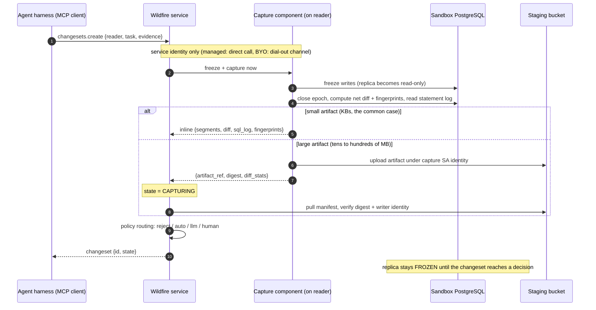
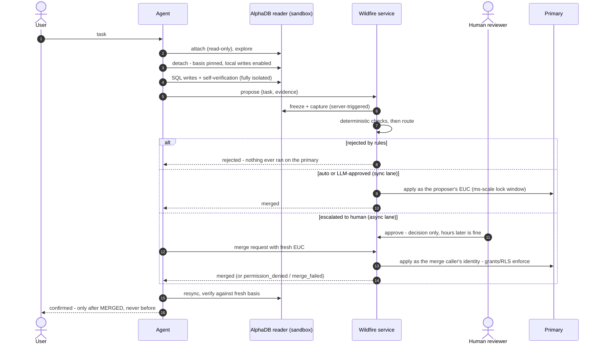
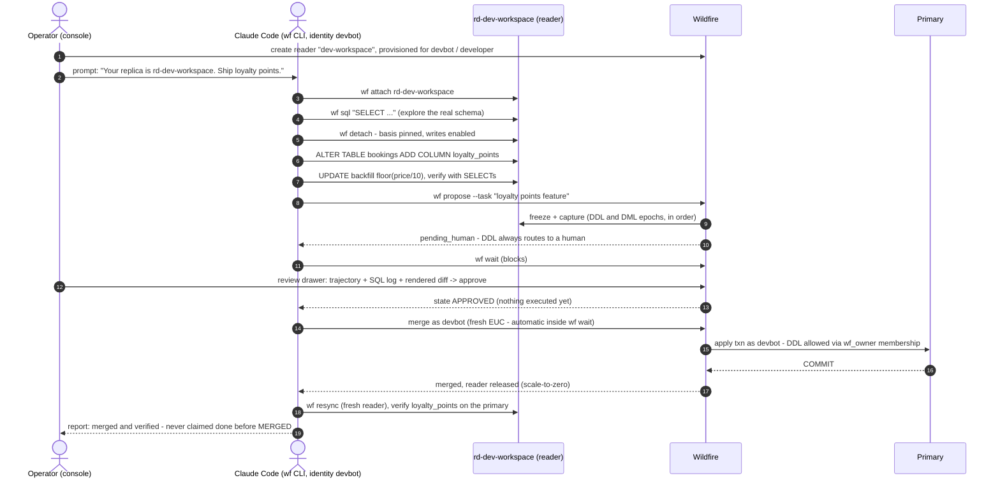
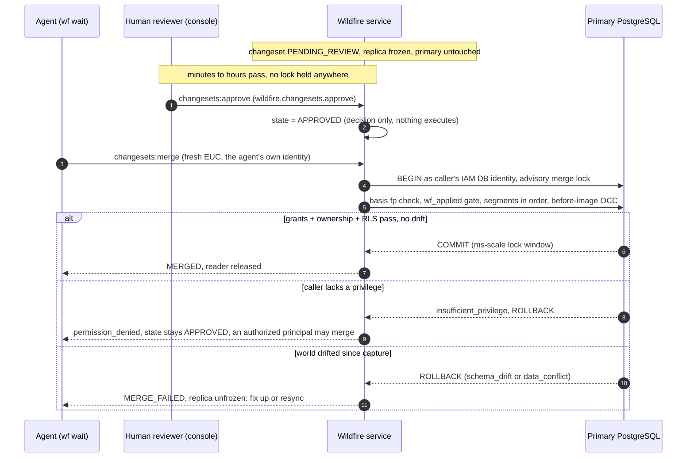

# Wildfire on AlphaDB — Demo Design, API CUJs, and the Assumptions Behind It

Status: discussion draft, based on the working demo under `proto/` (validated
2026-08-01..03). Companion docs: go/wildfire-rfc1 (concept), rfc2 (Project
Scoop), rfc3 (capture/validate/re-apply mechanics), `proto/DESIGN.md`
(merge-engine decision record).

The demo builds **one** end-to-end path through the Wildfire protocol. The
parent RFCs deliberately leave many questions open; to get a running system we
had to answer each of them *somehow*. This doc separates the three layers:

1. the **API/CUJ surface** we believe is roughly right,
2. the **mechanics** we validated with runnable evals,
3. the **assumptions** we made to close open questions — each listed with its
   alternatives, so review can target the actual decision points.

---

## 1. Target API design (AlloyDB-based)

This section describes the API we would actually build, not the demo's HTTP
surface (the demo's endpoints are a stand-in; the mapping is at §1.6).
Standing assumption, marked throughout: **we do not know AlphaDB's real API
yet** — we assume reader lifecycle lands on the AlloyDB API surface
(`projects.locations.clusters.*`) in some form, and design Wildfire against
that assumption. Everything in §1.2 needs to be checked with the AlphaDB
team; everything in §1.3–1.5 is net-new Wildfire surface regardless.

### 1.1 Layering

| Layer | Owns | Surface |
|---|---|---|
| AlloyDB / AlphaDB (assumed) | replica lifecycle: create / connect / detach / resync / delete; replica-level IAM | AlloyDB API, new `readers` resource or equivalent |
| PostgreSQL (existing) | all SQL execution, on primary and on readers | PG wire protocol + IAM DB authn — **no SQL-over-REST anywhere** |
| Wildfire (new) | changeset lifecycle: propose / review / merge / revert; review policies | new API, resources under the cluster |

*Figure 1 — system layering.*
[banana: Clean GCP-documentation-style architecture diagram, flat vector, white background, blue/gray palette with one orange accent. Bottom: a wide storage bar labeled "Rapid Bucket — Iceberg PostgreSQL format". Left: a database cylinder "AlloyDB primary cluster (HA)" with an arrow down to the bucket labeled "async replication ≤1s". Middle: three small boxes "ephemeral PG reader (Cloud Run)" with dashed arrows down to the bucket labeled "attach, read-only"; one of the three readers is orange and labeled "detached — Wildfire sandbox (copy-on-write)" and has a small shield icon attached labeled "capture component". Right: a box "Wildfire service" containing two stacked items "Changesets" and "Review policies"; an arrow from the shield icon to the Wildfire service labeled "captured artifact"; an arrow from the Wildfire service to the primary cylinder labeled "merge — apply txn runs as the caller's IAM DB identity". Top: a robot icon "agent" with arrows to the orange reader ("SQL, PG wire") and to the Wildfire service ("propose / merge"); a person icon "reviewer" with an arrow to the Wildfire service labeled "approve".]

### 1.2 AlphaDB reader lifecycle (assumed AlloyDB APIs)

- `clusters/*/readers.create` — provision a reader attached to the Rapid
  Bucket (read-only, ≤1 s lag, zero primary impact). Client-supplied resource
  id (the operator's chosen name). Sub-second attach means the minutes-scale
  Instance LRO model doesn't fit; readers need a lightweight resource.
  "Provisioned for an agent" = IAM policy binding on the reader resource
  (`setIamPolicy`), not a Wildfire concept.
- **Connect (bind)** — not an API call: `getConnectionInfo` + PG wire /
  Auth Proxy, gated by `alloydb.readers.connect` on the resource, IAM DB
  authn for the session. This is exactly today's AlloyDB connectivity.
- `readers/*:detach` — stop syncing from Rapid, pin the **basis** (schema
  fingerprint + snapshot token), local storage becomes copy-on-write.
  Custom-verb style matches existing AlloyDB verbs (`:promote`,
  `:failover`, `:restart`). This is the Wildfire session start and the one
  AlphaDB API that exists *because of* Wildfire.
- `readers/*:resync` — re-attach to Rapid, discard local writes. The
  universal recovery verb.
- Scale-to-zero after merge = reader deletion (AlphaDB semantics: no state
  outside the bucket).

*Figure 2 — reader lifecycle.*
[banana: State-machine diagram, flat vector, white background, rounded rectangles, blue/gray palette with green and amber accents. Four states left to right: "ATTACHED — read-only, syncing ≤1s from Rapid" → arrow labeled "detach (pin basis)" → "SANDBOX — writable, copy-on-write" → arrow labeled "propose (service freezes)" → "FROZEN — reads only, changeset under review" → green arrow labeled "merged" → "RELEASED — scale-to-zero". An amber return arrow from FROZEN back to SANDBOX labeled "rejected / merge_failed (unfreeze, fix up, re-propose)". Dashed return arrows from both SANDBOX and FROZEN back to ATTACHED labeled "resync (discard local work)". Small caption under the diagram: "one in-flight changeset per reader, by construction".]

Open fork to resolve with the AlphaDB team: are readers **managed resources**
(above), or **BYO containers** on customer Cloud Run/GKE (the alpha_db doc
leans this way)? If BYO, `create/detach/resync` degrade to client-side
container behavior, replica RBAC falls on Cloud Run per-service IAM, and
Wildfire first sees a reader at propose time (self-registration with a basis
token). Wildfire's own API (§1.3+) is identical under both answers.

### 1.3 Wildfire resources

Two new resource types, both under the cluster (NOT under the reader —
readers are ephemeral and scale to zero; changesets are durable audit
assets that outlive them).

**`clusters/*/changesets/*`** — the reviewable, appliable artifact:

```
Changeset
  reader          string        # reader resource name (may already be gone)
  proposer        principal     # from request auth — never from the payload
  task            string        # stated intent; evidence, checked against diff
  basis_fp        string        # schema fingerprint at detach
  final_fp        string        # schema fingerprint at capture
  segments[]      DDL {statements[], fp_before, fp_after}
                | DML {diff_ref, row_count}
  diff_stats      per-table {inserted, updated, deleted}
  diff_ref        object ref    # bulk before/after rows staged to object
                                # storage — the diff does not move through
                                # the API or the agent
  sql_log[]       {seq, sql}    # from the reader's server-side statement log
  evidence        {trajectory[], attachments[]}   # harness-supplied, untrusted
  review          {lane, checks[], verdict, reason, reviewer_or_model, time}
  merge_attempts[] {caller, outcome, detail, lock_window_ms, time}
  reverts         changeset ref # set on compensating changesets
  state           CAPTURING | PENDING_REVIEW | APPROVED | REJECTED | MERGED
                | MERGE_FAILED | REVERTED | EXPIRED
```

Merge attempts are a repeated field because `permission_denied` leaves the
changeset APPROVED — several callers may try. EXPIRED implements approval
TTL.

*Figure 3 — changeset state machine.*
[banana: State-machine diagram, flat vector, white background, rounded rectangles. States and transitions: "CAPTURING" → "PENDING_REVIEW" (label: "artifact validated"); PENDING_REVIEW → "REJECTED" (red, label: "rules / LLM escalation upheld / human reject") and PENDING_REVIEW → "APPROVED" (label: "auto, LLM approve, or human approve — decision only"); APPROVED → "MERGED" (green, label: "merge request, applied under caller's EUC"), APPROVED → "MERGE_FAILED" (amber, label: "drift / conflict — full rollback"), APPROVED → "EXPIRED" (gray, label: "approval TTL"), and a self-loop on APPROVED labeled "permission_denied — stays approved, another caller may merge"; MERGED → "REVERTED" (label: "compensating changeset, DML-only"). Blue/gray palette, green for MERGED, red for REJECTED, amber for MERGE_FAILED.]

**`clusters/*/reviewPolicies/*`** — one per principal-or-role, admin-authored:

```
ReviewPolicy
  scope_tables[]        # or derive_from_grants: true (the DB's GRANTs are
                        # the source of truth; this is then pre-screen only)
  hard_max_rows         # above -> deterministic reject
  auto_max_rows         # above -> human
  allow_ddl             # false -> reject; true -> DDL still always human
  small_change_reviewer AUTO | LLM | HUMAN
  llm_guidance          # free text fed to the LLM reviewer
  approval_ttl          # approved-but-unmerged expires after this
```

### 1.4 Wildfire methods

| Method | IAM permission | Semantics |
|---|---|---|
| `changesets.create` (propose) | `wildfire.changesets.create` + use of the reader | Capture is **server-side** (§1.5): the service closes the capture, computes the diff, pulls the SQL log. The caller supplies only `task` + `evidence`. Returns the changeset; small approved DML may merge inline under the caller's still-live EUC (sync path). |
| `changesets.get / list` | `.get` / `.list` | Status polling; state transitions also published to Pub/Sub (the `wf wait` / MCP long-running-task channel, per rfc1 appendix / rfc2). |
| `changesets:approve` / `:reject` | `wildfire.changesets.approve` | **Decision only — never executes.** Precedent: PAM `grants.approve/deny`, Access Approval. Human-latency friendly: no LRO, no held transaction. Auto/LLM lanes are the service applying the ReviewPolicy internally. |
| `changesets:merge` | `wildfire.changesets.merge` | Applies an APPROVED changeset **under the caller's EUC**: the service opens the apply transaction on the primary as the caller's IAM DB identity; grants/ownership/RLS enforce natively. Precedent: BigQuery `jobs.insert` (job runs as the caller, table ACLs checked against the caller). Outcome `permission_denied` keeps state APPROVED. |
| `changesets:revert` | `wildfire.changesets.merge` (it is a merge) | Creates a NEW compensating changeset (`reverts` set), applied under the revert caller's EUC through the same path. DML-only. |
| `reviewPolicies.get / update` | `wildfire.reviewPolicies.*` | Admin CUJ (the console Policies page). |

Approve and merge are deliberately **separate permissions**: reviewers decide,
mergers execute, and the async gap between them is bridged by fresh
credentials at merge time — never by stored credentials or a shared applier
service account (§3.1).

### 1.5 Who records what — capture responsibility and trust

The question that decides review integrity: after detach, who writes down
the SQL log, the diff, the status? Rule: **the model authors nothing that
the reviewer relies on**. Deterministic components produce every load-bearing
artifact; the agent's own account of events is labeled evidence, never data.

| Artifact | Produced by | Trust | How |
|---|---|---|---|
| basis / final schema fingerprints | Wildfire capture component on the reader | authoritative | computed from catalog at detach / propose |
| SQL log | the reader database itself | authoritative | server-side statement logging (`log_statement=all` / pgaudit — cheap: the reader is single-tenant); records what actually ran, not what the model says it ran |
| data diff + segments | Wildfire capture component on the reader | authoritative | **derived from sandbox state, never authored**: snapshot-vs-current EXCEPT today; transition-table triggers / logical decoding at scale. Bulk rows staged straight to object storage — the diff never passes through the agent |
| changeset state | Wildfire service | authoritative | service-owned state machine |
| reader state | AlphaDB control plane | authoritative | attached / detached / released |
| task | caller of propose | untrusted evidence | the reviewer checks the diff against it |
| trajectory (chat, thoughts, tool calls) | the **harness** (MCP client / agent framework) — never free-filled by the LLM | untrusted evidence | attached on propose; injection-scanned (rfc1) |

*Figure 4 — trust boundary on the reader.*
[banana: Security-boundary diagram, flat vector, white background, blue/gray palette with red accents for the trust boundary. A large light-gray box labeled "Reader container — untrusted scratch space". Inside it: a robot icon "agent (may be superuser locally)" connected by a solid arrow labeled "SQL, PG wire" to a database cylinder "sandbox PostgreSQL" that has a small attached paper icon "server-side statement log (pgaudit)"; and a separate small dark-blue locked box "Wildfire capture component (trusted code)" with thin arrows reading from the database cylinder and from the statement log. A red dashed arrow from the robot to the locked box crossed out with a red X, labeled "no client-facing interface". Outside the gray box, right side: a box "Wildfire service" receiving a solid arrow from the locked box labeled "inline artifact (small)" and a dashed arrow labeled "dial-out command channel (BYO)"; below, a storage bar "staging bucket" receiving an arrow from the locked box labeled "staged upload, capture SA identity (large)" and connected to the Wildfire service by an arrow labeled "pull + verify writer identity". Caption: "the model authors nothing the reviewer relies on".]

The capture component lives with the reader (extension or sidecar in the
reader container — works identically under the managed and BYO forks) and is
Wildfire code, not agent code. Propose is therefore nearly empty on the
wire: `{reader, task, evidence}` — everything else is computed.

**Propose data flow.** Two orthogonal decisions, chosen on different axes:
who *triggers* capture (control plane — follows the deployment fork) and how
the bytes *travel* (data plane — follows artifact size). The agent/harness
never authors or carries the artifact under any combination; it only ever
says "propose now".

*Control: capture is server-triggered, exclusively.*

The capture component is passive and workflow-stateless — it does not know a
propose is happening. The agent calls `changesets.create {reader, task,
evidence}`; the service resolves the reader's capture channel, issues
"freeze + capture now" as the Wildfire service identity, and receives the
artifact from trusted code end-to-end. No client-supplied content or
references exist anywhere, so no attestation machinery is needed.

A client-triggered variant was considered and rejected: it requires the
component to expose an artifact-output interface to clients — an
exfiltration and tamper surface (any principal with replica access could
dump, replay, or modify-then-upload capture data) — and it leaves the
component unable to know when to freeze/unfreeze, since the workflow state
machine lives in the service. The component's control interface accepts
calls from the Wildfire service identity only.

Connectivity is not a reason to give this up. Managed readers: the service
runs them, address + OIDC are its own; propose is a human-workflow-rate,
on-demand call, so no standing connections to a million readers. BYO
readers in a customer VPC: the component **dials out** to the service and
holds a command channel (the GKE Connect-agent pattern) — same control
semantics, reversed transport direction, no inbound path required.

*Freeze: propose pins the replica.*

On propose the service freezes the sandbox (writes refused) *before*
capture, so the artifact is cut from a quiesced state — no snapshot
subtleties, and the replica provably matches what the reviewer sees. The
freeze holds through PENDING_REVIEW and APPROVED; `merged` releases the
reader (scale-to-zero); `rejected` / `merge_failed` unfreezes it so the
agent can fix up and re-propose (or resync). One in-flight changeset per
reader, by construction.

*Transfer: how the bytes travel.*

- **Inline (small — the common case; a booking changeset is a few KB).**
  The capture component returns diff + SQL log + fingerprints directly in
  the capture response; the service stores them on the changeset. No storage
  round-trip; propose returns PENDING_REVIEW synchronously.
- **Staged (large — a bulk backfill's diff is tens–hundreds of MB).** The
  component uploads to a staging prefix in the cluster's bucket under its
  own workload identity and returns `{artifact_ref, digest, diff_stats}`;
  the service pulls and validates from storage (state CAPTURING until it
  passes). At merge, the engine COPYes the diff from staging straight into
  the apply transaction — storage to primary, never through the API or the
  agent. Staged artifacts are GC'd once the changeset reaches a terminal
  state. Standard GCP big-payload pattern (BigQuery load jobs reference GCS
  URIs).

Always inline in the API regardless of mode: diff_stats, a sampled-rows
preview for the console, the SQL log (typically KBs; truncated-with-reference
beyond a cap). AlphaDB bonus: the basis already lives in the Rapid Bucket and
the sandbox's local copy-on-write storage *is* the delta — staging a
changeset is close to "publish the local delta + a row-diff manifest", not a
full re-upload. This is a natural answer to the deferred capture-efficiency
item in DESIGN.md.

*Figure 5 — propose sequence (server-triggered capture, size-adaptive transfer).*



One deterministic cross-check falls out for free: the trajectory's claimed
tool-call SQL must be consistent with the server-side statement log. A
mismatch (statements executed but absent from the story, or vice versa) is
itself a review signal — automatic, no LLM needed.

Two-layer trust argument, so capture honesty is never load-bearing for
safety: **merge safety** is guaranteed independently by the engine
(fingerprint guards + before-image OCC + the merge caller's own grants at
apply) — a forged or buggy diff cannot exceed the merger's DB permissions
and cannot overwrite drifted rows. Capture integrity is about **review
quality**: the reviewer must see what the agent actually did. Server-side
capture buys the second; the engine already owns the first.

### 1.6 Demo → target mapping

| Demo | Target | Note |
|---|---|---|
| `POST /api/branches` | `readers.create` (assumed AlloyDB) | demo name→id convention matches client-supplied resource ids |
| `wf attach` | PG connect + reader IAM | not an API |
| `POST .../detach`, `/resync` | `readers:detach`, `:resync` (assumed AlloyDB) | |
| `POST .../exec` | **nothing** — PG wire | demo-only convenience; delete from the target picture |
| `POST .../propose` | `changesets.create` | demo shim: capture runs in the control-plane app (server-side already); trajectory shipped by the wf CLI / agent harness |
| `POST .../review`, `/merge`, `/revert` | `changesets:approve/:reject`, `:merge`, `:revert` | identical semantics, incl. EUC merge |
| `GET/PUT /api/policies` | `reviewPolicies.*` | demo keys by role name; target keys by principal/role |

Two demo decisions that carry over unchanged: **replica ≠ task** (a reader is
provisioned once and serves many tasks; the task travels with the changeset,
stated at propose, because it is what review checks the diff against) and
**AlphaDB vocabulary, not git vocabulary** (attach/detach/propose/resync —
no "branch/checkout/commit").

## 2. CUJs demonstrated

*Figure 6 — overall request flow (all lanes).*



**CUJ-0 — Operator.** Console (AlloyDB-style, :8777): provision a named
replica for an agent, watch the live activity stream, review pending
changesets (full agentic trajectory + rendered diff + LLM pre-screen), tune
per-role policies, run Studio SQL directly on the primary (which is also how
we inject out-of-band drift to test conflict handling).

**CUJ-1 — Customer-facing booking agent** (Wingman, role `booking`). Real
Gemini tool-loop; books/rebooks seats in its sandbox, proposes; small DML
passes deterministic checks → LLM review → auto-merge, seconds end-to-end.
The RFC1 "Airplane Alternatives" family-split scenario runs as a scripted
variant.

**CUJ-2 — Developer agent** (external Claude Code session, role `developer`).
Operator provisions a replica, hands the id over in a one-line prompt; the
agent explores, ships a schema change (`ADD COLUMN` → backfill →
`SET NOT NULL`), proposes. DDL always routes to human; the agent blocks on
`wf wait`, then resyncs and verifies what actually landed. This is the
mixed-DDL+DML case that motivated epoch segmentation.

*Figure 7 — CUJ-2 as actually demoed (operator-provisioned replica + external Claude Code).*



**CUJ-3 — Analytics agent** (OpsBot, role `analytics`). Bulk retention sweep
(GDPR anonymization) — large-N DML, LLM-reviewed against admin guidance,
revertable after merge.

**CUJ-4 — Out-of-scope attempt.** Same analytics agent tries to touch a table
outside its role's allowlist → deterministic reject, no LLM, no human, with
the failed checks in the response.

## 3. How data diff and merge work (the validated core)

Full mechanics in rfc3 and `proto/DESIGN.md`; the shape in one paragraph:

The changeset is **epoch-segmented**: DML accumulates as an incremental net
row diff (`{pk, op, before, after, changed}` per row, computed by
snapshot-EXCEPT in the sandbox); every DDL statement closes the current DML
epoch and records its own segment bracketed by before/after **schema
fingerprints** (md5 over columns+indexes+constraints). Segments preserve the
agent's ordering, because DDL/DML dependencies go both ways (ADD
COLUMN→backfill vs backfill→SET NOT NULL).

*Figure 8 — epoch-segmented capture.*
[banana: Horizontal timeline diagram, flat vector, white background. Top row labeled "agent session in the sandbox": a left-to-right timeline with a green bar "DML epoch 1 — accumulates net row diff", then an orange vertical marker "DDL: ALTER TABLE ADD COLUMN, brackets fp_before → fp_after", then a second green bar "DML epoch 2 — backfill diff", then a second orange marker "DDL: SET NOT NULL", ending in a gray flag "capture". Below, an arrow down to a second row labeled "resulting changeset": four ordered boxes in a chain [DML diff 1] [DDL statements + fingerprints] [DML diff 2] [DDL statements + fingerprints], wrapped in a bracket with a lock icon labeled "applied on the primary in one transaction, in the agent's order". Caption: "every DDL closes the current DML epoch — order preserved because DDL/DML dependencies go both ways". Green/orange/gray on white, clean vector style.]

Apply (M1, default) runs in **one transaction** under a global advisory lock:
basis fingerprint check → idempotency gate (`wf_applied` PK) → per segment:
DDL = fp-check→replay→fp-check; DML = stage → ordered `FOR UPDATE` →
**before-image conflict check on changed columns only** → key-join
UPDATE/INSERT/DELETE that stamps only changed columns. Any failure rolls back
the whole transaction — zero residue.

A second mode (M2, execute-verify) replays the SQL log and strictly compares
the recomputed net diff (including before-images) against the approved one;
mismatch → rollback. It exists for the cases diff-apply can't cover (rows
that arrived after the snapshot) and structurally rejects nondeterministic
SQL. It is rfc3's "advanced variant" of Option 2 — not a separate option.

### 3.1 Identity: whoever calls merge, their credentials run the writes

The sandbox is **fully untrusted scratch space** — the agent may be superuser
there, and nothing about its local privileges is believed. The single
enforcement point is the apply transaction on the primary, which the merge
engine opens **as the merge caller's database identity** (on AlloyDB, the
caller's IAM principal *is* a DB user via IAM DB authn — no mapping table).
PG then checks table grants, ownership (DDL), and RLS natively while the
writes run; `permission_denied` is a first-class merge outcome and the
changeset stays `approved` so a sufficiently-privileged caller can still
merge it.

This is why review and merge are separate API calls: human review takes
hours, EUC tokens don't live that long, and storing credentials is off the
table. Approval binds to the static artifact (diff-as-contract + OCC make a
late merge safe — it applies exactly the approved effect or conflicts out);
the merge is a fresh authenticated request. The agent's `wf wait` already
polls, so on approval it submits the merge itself with its own live
identity — from the agent's view, wait still just returns "merged". A shared
applier service account was considered and rejected: its privileges would be
the union of all profiles' — a confused-deputy escalation path. If nobody
with sufficient privileges ever calls merge, the changeset never lands —
which is the correct semantics, not a failure mode.

Verified live: opsbot attempting to merge devbot's approved DDL changeset is
refused by the primary itself ("must be owner of table bookings"); the same
changeset then merges cleanly when devbot requests it. Same rule for revert.

*Figure 9 — async review and EUC merge.*



What the evals established (`harness/run_eval2.py` 14/14,
`test_concurrent.py`, `eval/REPORT*.md`):

- **C5 is the dominant axis, empirically.** Option 1's lock window equals
  approval latency (1510 ms with a simulated 1.5 s approval — unbounded with
  a human); diff-apply stays 8–84 ms regardless of review latency. This is
  the property that makes human-in-the-loop viable at all.
- **Column-level drift tolerance works.** Two agents editing different
  columns of the same row both merge, both edits preserved (S2); same
  row+column → second one gets `data_conflict` (S3). Agents that don't truly
  collide don't pay for each other.
- **Revert works as designed** — clean rows restore; rows edited since the
  merge conflict out, because the revert goes through the same engine with
  the same OCC guards.

## 4. Review policy design

A two-layer ladder, evaluated at propose time (`demo/policy.py`):

1. **Deterministic gate** (admin-authored per-role template): table
   allowlist, hard row ceiling, DDL allowed y/n. Any failure →
   **reject**, with the failed checks named. No LLM, no human, no appeal
   within the changeset.
2. **Routing** for what passes: DDL → **human**, always. Rows above
   `auto_max_rows` → human. Small DML → the role's `small_reviewer`:
   `auto` (rules only), `llm`, or `human`.

The LLM reviewer is a real Vertex Gemini call returning strict JSON
`{approve, reason}`. Its evidence: the stated task, admin-authored
per-role guidance (free text, editable in the console), the SQL log, a
sampled diff with summary stats, the **full agentic trajectory** (user
messages, tool calls, confirmations), and today's date. An LLM approve
auto-merges; an LLM escalate goes to human. The LLM can never approve its way
past a deterministic rule — the ladder only narrows.

Two prompt-engineering findings that generalize: the reviewer wrongly
escalated a legitimate change until it could see the *conversation* (the
customer had explicitly confirmed), and wrongly escalated a date-based
retention sweep until the prompt carried the current date. Review quality is
a function of evidence packaging, not just model quality.

## 5. Failure and recovery flows

### 5.1 Merge failure taxonomy

All failures are full-transaction rollbacks — the primary is untouched, the
changeset is marked, the replica returns to `sandbox` state.

| Outcome | Meaning | Agent recovery |
|---|---|---|
| `schema_drift` | Basis or per-segment fingerprint mismatch — schema changed under the proposal | resync (mandatory), redo |
| `data_conflict` | A `changed` column drifted vs the before-image; blast radius reported per row | resync, redo; only true collisions pay |
| `verify_mismatch` (M2) | Replay produced a different diff than approved — drift or nondeterministic SQL | resync; if nondet, rewrite the SQL |
| `error` | FK violation, timeout, duplicate idempotency key… | retry is safe (idempotency gate) |
| `permission_denied` | The primary refused the merge **caller's** DB identity (grant/ownership/RLS) | changeset stays `approved`; a caller with sufficient privileges merges it |
| `rejected` | Review said no (deterministic or human) | rethink; resync if stale |

### 5.2 The recovery model is resync + redo, not rebase

Deliberate. The captured SQL log makes redo mostly mechanical for an agent,
and review-latency staleness only raises conflict *probability* — it never
blocks anything (review is offline). A rebase fast-path (resync + mechanical
replay + diff-of-diffs delta review) is designed but deferred until conflict
rates justify it.

### 5.3 Revert

A merged DML changeset can be reverted: the engine builds a *new* compensating
changeset (before/after swapped, ops inverted, audit-chained via `reverts`)
and applies it through the same path with the same OCC guards. Positioning:
a hot undo button, not a time machine — rows edited since the merge will
conflict out, DDL has no mechanical inverse, and no mechanism (including
PITR) undoes external side effects.

---

## 6. Assumptions ledger

Everything above runs end-to-end **because** we picked answers to open
questions. Each entry: what we assumed, why, and the live alternatives.

**A1. The sandbox is a working copy, not a scratchpad.**
(rfc3 open question #1 — the one that "sizes the whole capture-and-apply
effort.") The agent edits a full replica; the result *is* the diff; the full
apply subsystem is required. Chosen because it matches the AlphaDB
detach-a-reader model and supports arbitrary agent SQL including DDL.
*Alternative:* scratchpad — actions are logic, the diff is merely evidence,
apply machinery shrinks dramatically. Plausible for narrow tool-mediated
agents (CUJ-1 could live with it); hopeless for CUJ-2.

**A2. Artifact = row diff for DML, guarded replay for DDL.**
DDL has no row diff, so inside one changeset we mix rfc3's Option 2 (DML)
with a fingerprint-bracketed Option 1 (DDL). DDL's "before-image" is the
schema fingerprint. *Alternatives:* pure Option 1 (measured: lock window =
approval latency — the strawman); M2-style execute-verify for everything
(covers new rows, but structurally rejects legitimate nondeterminism and
runs agent SQL on the primary).

**A3. Capture = snapshot-EXCEPT.**
Zero PG configuration, works on a stock container — right for a PoC, O(table
scan) per epoch close, so it degrades with table count × DDL count.
*Alternatives (same artifact, cheaper):* statement triggers + transition
tables (L4), logical decoding (L5). Swappable without touching the apply
side — that's the point of making the diff the contract.

**A4. Conflict = same row AND same column drifted.**
Optimistic, column-granular OCC. Maximizes concurrent mergeability; the known
hole is cross-column invariants torn by two column-disjoint merges
(documented in DESIGN.md §5). *Alternatives:* row-level strictness (simpler,
more false conflicts); read-set-based validation (catches predicate-level
staleness — requires read-set capture, deferred); commutative per-row deltas
(rfc3 open Q4 — shrinks conflicts for numeric columns, not idempotent).

**A5. Merges are globally serialized** (one advisory lock).
Trivially correct, removes the DDL TOCTOU, and at ms-scale windows the queue
depth is a non-issue for the CUJs shown. *Alternatives:* per-database or
per-table locks, or a real merge-queue service — only needed if merge
throughput, not review throughput, becomes the bottleneck (unlikely: review
is hours, merge is milliseconds).

**A6. No basis TTL.**
A detached replica can sit for days and still propose; staleness only
surfaces as conflict probability at merge time. *Alternative:* TTL +
forced resync, or re-validation of the basis at review-start. A real product
probably wants at least a warning ("basis is 3 days old, 12 merges have
landed since").

**A7. Policy = admin-authored role templates** (allowlist, two row ceilings,
DDL bit, reviewer choice, NL guidance). Small enough for a console page,
expressive enough for all four CUJs. Critically: authored by the admin, never
by the agent or derived from the task (rfc3 open Q3). *Alternatives:* a rule
DSL (`deny if touched ⊄ read`); deriving write scope from PSV read
constraints ("mutated rows must be visible under read constraints" — rfc1);
column-group policies to patch the A4 invariant hole.

**A8. The trajectory is client-supplied evidence.**
The agent (or its harness) ships its own history with the proposal, and the
LLM reviewer treats it as truthful — a demo-grade trust boundary. We already
hit the soft version of the failure: an agent *claiming* success while its
changeset sat pending (fixed with prompt rules + a harness-level guard). A
production Wildfire must capture the trajectory server-side at the proxy
(rfc2's architecture supports exactly this), treat agent-authored text as
untrusted, and scan it for injection (rfc1's malicious-content requirement —
not prototyped at all).

**A9. Identity model — answered, no longer deferred.**
Settled design (implemented in the demo): AuthN = IAM on the API surface
(OIDC, per rfc2); replica-level authz = IAM binding on the replica resource
(AlphaDB readers are Cloud Run/GCE instances, so per-resource IAM comes for
free); data authz = the merge **caller's** DB identity, enforced by the
primary itself during the apply transaction (§3.1). No Wildfire-private role
system: review-policy profiles attach to real principals/roles, the sandbox
is untrusted by construction, and no shared service account ever applies.
*Remaining alternative rejected:* profile-bound applier SA for unattended
async merges — confused-deputy risk; the answer is that approved changesets
wait for an authorized merger, indefinitely if need be. Demo shim: the
principal→DB-user mapping is a lookup table; on AlloyDB it's IAM DB authn.

**A10. New rows are out of scope for a diff (C4d).**
A diff can't cover rows that arrived after the snapshot. The demo's answer:
that's what M2 is for, choose per changeset. *Alternatives:* re-scan/re-derive
at apply ("Toothbrush" needs this if orders keep arriving); or explicitly
document per-CUJ that late arrivals are the next changeset's problem.

**A11. INSERT identity = client-generated ids.**
Text ids (`BK-…`) sidestep sequence collision entirely. *Alternatives:*
UUIDv7 by convention; sequence fix-up at apply (fragile); reserved ranges.

**A12. Replicas are simulated by per-replica PG databases (pg_dump clone).**
Faithful to the *semantics* (isolated, writable after detach, discardable)
but not the *economics* — a real AlphaDB reader attaches to Rapid in
sub-seconds with copy-on-write local storage, no bulk copy. Similarly:
control plane on SQLite in-process (no HA story), no Cloud Run, no
throttling/queueing of applies (rfc2 lists throttling as a safeguard), no
PubSub result delivery. All simulation-boundary items, none load-bearing for
the protocol claims.

## 7. Open questions (carried forward + newly surfaced)

From the RFCs, still open after the demo:

- **Scratchpad vs working copy at scale** (A1): the demo proves working-copy
  *works*; it says nothing about what it *costs* at real table sizes.
  Capture efficiency (A3) is the same question in mechanism form.
- **C4d / late-arriving rows** (A10): which CUJs actually need re-scan?
- **Per-row commutative deltas** (rfc3 Q4): worth it for hot counters?
- **Long-lived propose/validate/execute loops** (rfc2's open question):
  the demo is strictly one-shot per changeset; an interactive
  validator-mediated session is a different API shape.

Newly surfaced by building it:

- **Evidence trust boundary** (A8) — the biggest one. Server-side trajectory
  capture, injection scanning, and how much weight an LLM reviewer may put on
  agent-authored text.
- **Review-evidence packaging is load-bearing**: two real Gemini
  misjudgments were fixed by adding conversation context and the current
  date. What is the *contract* for reviewer evidence, and who owns it?
- **Basis lifetime policy** (A6) and the UX of telling an agent "you're
  stale" before it wastes work.
- **Revert authorization**: partially answered — a revert applies under the
  *requester's* credentials like any merge, so the DB gates it. Still open:
  should a revert also pass review routing, and what does revert-of-revert
  mean?
- **Approval TTL**: OCC makes a stale merge safe (it conflicts out), but a
  human's approval judgment ages — policy likely wants "approved changesets
  expire after N hours, re-review required".
- **DDL undo story**: none exists mechanically. Is "escalate to a human with
  the audit trail" the actual product answer, or do we want inverse-DDL
  synthesis for the easy cases (ADD COLUMN ↔ DROP COLUMN)?
- **Multi-statement / multi-agent composition**: two proposals from the same
  replica, or one task spanning replicas, are currently undefined-by-refusal.

---

*Demo layout: `proto/app` (console, :8777) · `proto/demoapp` (simulation
control, :8778) · `proto/devws` (external-agent CLI workspace) ·
`proto/harness` + `proto/eval` (merge-engine evals) · `proto/DESIGN.md`
(mechanics decision record).*
